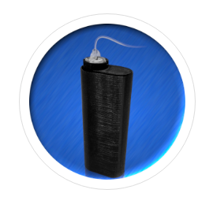

# Livet Care

Livet Care nasceu de uma dor muito grande e da vontade de poder ajudar outros com a mesma dor.

Em 2016 descobri que meu filho Fred, estava diabético tipo 1 com apenas 5 anos de idade. E que no fatídico 04/09/2016 para frente ele seria insulino dependente.

Navegando pela internet em busca de novas tecnologias, descobri uma pessoa que desenvolveu uma bomba de insulina impressa em 3D.

Tentei contato com o criador da solução, mas todas as tentativas foram em vão, então resolvi fazer a minha própria

<iframe width="560" height="315" src="https://www.youtube.com/embed/qwzOXXWGJxM" frameborder="0" allow="accelerometer; autoplay; encrypted-media; gyroscope; picture-in-picture" allowfullscreen></iframe>

